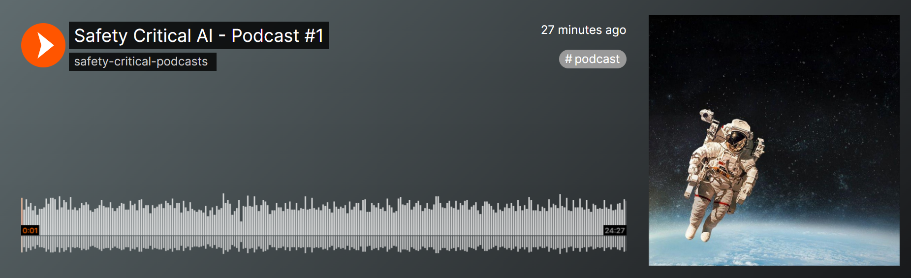
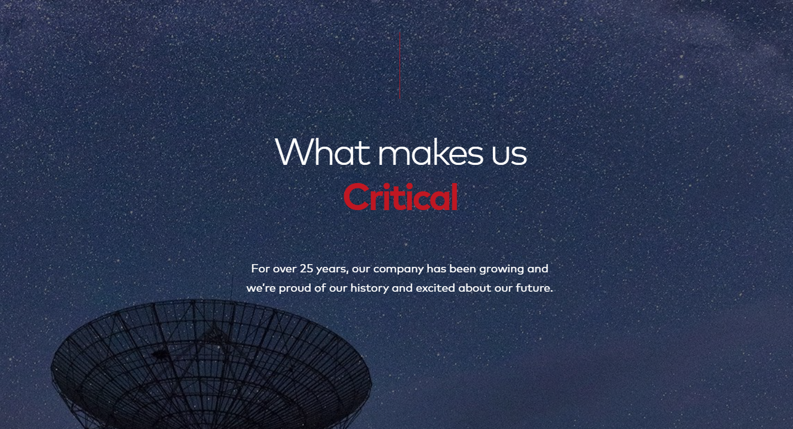

# Awesome Safety-Critical AI

[](https://awesome.re)    


**Welcome to Awesome Safety Critical AI!**

This repository contains a curated list of references on the role of AI in **safety-critical systems**, systems whose failure can result in loss of life, significant property damage or damage to the environment.

In here, you'll find references on safe and responsible AI, reliable ML, AI testing, V&V in AI, real-world case studies, and much, much more.

You can keep up to date by watching this GitHub repo 🤩


## Table of Contents

* [🌟 Editor's Choice](#top-picks)
* [🏃 TLDR](#tldr)
* [📝 Articles](#articles)
* [✍️ Blogs](#blogs)
* [📚 Books](#books)
* [📜 Certifications](#certifications)
* [🎤 Conferences](#conferences)
* [👩‍🏫 Courses](#courses)
* [📰 News](#news)
* [🤝 Initiatives](#initiatives)
* [📋 Reports](#reports)
* [📐 Standards](#standards)
* [🛠️ Tools](#tools)
* [📺 Videos](#videos)
* [📄 Whitepapers](#whitepapers)
* [👷🏼 Working Groups](#working-groups)
* [👾 Miscellaneous](#miscellaneous)
* [🏁 Meta](#meta)
* [About Us](#about-us)
* [Contributions](#contributions)
* [Citation](#citation)

## <a id="top-picks"></a>🌟 Editor's Choice

* 😈 A collection of [scary use cases of AI](https://github.com/daviddao/awful-ai), hoping to raise awareness to its misuses in society
* 💳 The now-classic [high-interest credit card of technical debt](https://static.googleusercontent.com/media/research.google.com/en//pubs/archive/43146.pdf) paper by Google
* 🤝 An introduction to [trustworthy AI](https://www.semanticscholar.org/paper/Trustworthy-AI-Part-1-Mariani-Rossi/2e550e23511711dae2689322741f9c113c6c506f) by NVIDIA
* 🚩 Lessons-learned from [red teaming hundreds of generative AI products](https://arxiv.org/abs/2501.07238) by Microsoft
* 🚨 Yet another [top 10 risks for LLM applications and Generative AI](https://genai.owasp.org/) by OWASP

## <a id="tldr"></a>🏃 TLDR

If you're in a hurry or just don't like reading, here's a podcast-style breakdown created with [NotebookLM](https://notebooklm.google/) (courtesy of [Pedro Nunes](https://github.com/pedrosaunu) 🙏)

<a href="https://soundcloud.com/safety-critical-podcasts/safety-critical-ai-101-podcast"></a>

## <a id="articles"></a>📝 Articles

* (Bach *et al.*, 2024) [Unpacking Human-AI Interaction in Safety-Critical Industries: A Systematic Literature Review](https://ieeexplore.ieee.org/document/10620168)
* (Belani, Vukovic & Car, 2019) [Requirements Engineering Challenges in Building AI-Based Complex Systems](https://arxiv.org/abs/1908.11791)
* (Bolchini, Cassano & Miele, 2024) [Resilience of Deep Learning applications: a systematic literature review of analysis and hardening techniques](https://arxiv.org/abs/2309.16733)
* (Bloomfield & Rushby, 2025) [Where AI Assurance Might Go Wrong: Initial lessons from engineering of critical systems](https://arxiv.org/abs/2502.03467)
* (Breck *et al.*, 2016) [What’s your ML test score? A rubric for ML production systems](https://research.google/pubs/whats-your-ml-test-score-a-rubric-for-ml-production-systems/)
* (Bullwinkel *et al.*, 2025) [Lessons From Red Teaming 100 Generative AI Products](https://arxiv.org/abs/2501.07238)
* (Cummings, 2021) [Rethinking the Maturity of Artificial Intelligence in Safety-Critical Settings](https://ojs.aaai.org/aimagazine/index.php/aimagazine/article/view/7394)
* (Dutta *et al.*, 2017) [Output range analysis for deep feedforward neural networks](https://arxiv.org/abs/1709.09130)
* (Faria, 2018) [Machine learning safety: An overview](https://scsc.uk/e503prog)
* (Johnson, 2018) [The Increasing Risks of Risk Assessment: On the Rise of Artificial Intelligence and Non-Determinism in Safety-Critical Systems](https://www.dcs.gla.ac.uk/~johnson/papers/SCSC_18.pdf)
* (Kuwajima, Yasuoka & Nakae, 2020) [Engineering problems in machine learning systems](https://link.springer.com/article/10.1007/s10994-020-05872-w)
* (Leofante *et al.*, 2018) [Automated Verification of Neural Networks: Advances, Challenges and Perspectives](https://arxiv.org/abs/1805.09938)
* (Lubana, 2024) [Understanding and Identifying Challenges in Design of Safety-Critical AI Systems](https://deepblue.lib.umich.edu/handle/2027.42/196092)
* (Luckcuck *et al.*, 2019) [Formal Specification and Verification of Autonomous Robotic Systems: A Survey](https://arxiv.org/abs/1807.00048)
* (Lwakatare *et al.*, 2020) [Large-scale machine learning systems in real-world industrial settings: A review of challenges and solutions](https://www.sciencedirect.com/science/article/abs/pii/S0950584920301373)
* (Mach *et al.*, 2021) [Architectural Patterns for Integrating AI Technology into Safety-Critical System](https://dl.acm.org/doi/fullHtml/10.1145/3489449.3490014)
* (Mariani *et al.*, 2023) [Trustworthy AI - Part I](https://www.semanticscholar.org/paper/Trustworthy-AI-Part-1-Mariani-Rossi/2e550e23511711dae2689322741f9c113c6c506f), [II](https://www.semanticscholar.org/paper/Trustworthy-AI-Part-II-Mariani-Rossi/9f354b3a88e6d6512d22ec152e6c6131a1e44cab) and [III](https://www.semanticscholar.org/paper/Trustworthy-AI-Part-III-Mariani-Rossi/ff446b46c5b9b4c0d18849d479fe5645f6182a36)
* (Pereira & Thomas, 2024) [Challenges of Machine Learning Applied to Safety-Critical Cyber-Physical Systems](https://www.mdpi.com/2504-4990/2/4/31)
* (Perez-Cerrolaza *et al.*, 2024) [Artificial Intelligence for Safety-Critical Systems in Industrial and Transportation Domains: A Survey](https://dl.acm.org/doi/10.1145/3626314)
* (Picardi *et al.*, 2020) [Assurance Argument Patterns and Processes for Machine Learning in Safety-Related Systems](https://ceur-ws.org/Vol-2560/paper17.pdf)
* (Ramos *et al.*, 2024) [Collaborative Intelligence for Safety-Critical Industries: A Literature Review](https://www.mdpi.com/2078-2489/15/11/728)
* (Sculley *et al.*, 2015) [Hidden Technical Debt in Machine Learning Systems](https://proceedings.neurips.cc/paper/2015/file/86df7dcfd896fcaf2674f757a2463eba-Paper.pdf)
* (Seshia, Sadigh & Sastry, 2020) [Towards Verified Artificial Intelligence](https://arxiv.org/abs/1606.08514)
* (Tambon *et al.*, 2021) [How to Certify Machine Learning Based Safety-critical Systems? A Systematic Literature Review](https://arxiv.org/abs/2107.12045)
* (Wang & Chung, 2021) [Artificial intelligence in safety-critical systems: a systematic review](https://www.semanticscholar.org/paper/Artificial-intelligence-in-safety-critical-systems%3A-Wang-Chung/dd56d26b7efd78651f9abf530741da8de7ca1a69)
* (Webster *et al.*, 2019) [A corroborative approach to verification and validation of human-robot teams](https://arxiv.org/pdf/1608.07403)
* (Yu *et al.*, 2024) [A Survey on Failure Analysis and Fault Injection in AI Systems](https://arxiv.org/abs/2407.00125)
* (Zhang & Li, 2020) [Testing and verification of neural-network-based safety-critical control software: A systematic literature review](https://www.sciencedirect.com/science/article/pii/S0950584920300471)
* (Zhang *et al.*, 2020) [Machine Learning Testing: Survey, Landscapes and Horizons](https://ieeexplore.ieee.org/document/9000651)

## <a id="blogs"></a>✍️ Blogs

* (CleverHans Lab, 2016) [Breaking things is easy](https://cleverhans.io/security/privacy/ml/2016/12/16/breaking-things-is-easy.html)
* (MathWorks, 2023) [The Road to AI Certification: The importance of Verification and Validation in AI](https://blogs.mathworks.com/deep-learning/2023/07/11/the-road-to-ai-certification-the-importance-of-verification-and-validation-in-ai)
* (restack, 2025) [Safety In Critical AI Systems](https://www.restack.io/p/ai-application-safety-protocols-answer-safety-in-critical-ai-systems-cat-ai)
* (think AI, 2024) [Artificial Intelligence in Safety-Critical Systems](https://medium.com/think-ai/ai-in-safety-critical-systems-6b778f26c965)

## <a id="books"></a>📚 Books

* (Chen *et al.*, 2022) [Reliable Machine Learning: Applying SRE Principles to ML in Production](https://www.amazon.com/Reliable-Machine-Learning-Principles-Production/dp/1098106229)
* (Huang, Jin & Ruan, 2023) [Machine Learning Safety](https://link.springer.com/book/10.1007/978-981-19-6814-3)
* (Huyen, 2022) [Designing Machine Learning Systems: An Iterative Process for Production-Ready Applications](https://www.amazon.com/Designing-Machine-Learning-Systems-Production-Ready/dp/1098107969?&_encoding=UTF8&tag=chiphuyen-20&linkCode=ur2&linkId=0a1dbab0e76f5996e29e1a97d45f14a5&camp=1789&creative=9325)
* (Joseph *et al.*, 2019) [Adversarial Machine Learning](https://www.amazon.com/Adversarial-Machine-Learning-Anthony-Joseph/dp/1107043468)
* (Tran, 2024) [Artificial Intelligence for Safety and Reliability Engineering: Methods, Applications, and Challenges](https://link.springer.com/book/10.1007/978-3-031-71495-5)
* (Varshney, 2021) [Trust in Machine Learning](https://www.manning.com/books/trust-in-machine-learning-cx)

## <a id="certifications"></a>📜 Certifications

* (ISTQB) [Certified Tester AI Testing (CT-AI)](https://www.istqb.org/certifications/certified-tester-ai-testing-ct-ai/)
* (USAII) [Certified AI Scientist (CAIS)](https://www.usaii.org/artificial-intelligence-certifications/certified-artificial-intelligence-scientist)

## <a id="conferences"></a>🎤 Conferences

* (ELLIS) [Robust ML Workshop 2024](https://sites.google.com/view/robustml2024/home)
* (MLOps Community) [AI in Production 2024](https://home.mlops.community/public/collections/ai-in-production-2024-02-18)
* (MLOps Community) [LLMs in Production 2023](https://home.mlops.community/public/collections/llms-in-production-conference-part-iii-2023)
* (Robust Intelligence) [ML:Integrity 2022](https://www.mlintegrityconference.com/)

## <a id="courses"></a>👩‍🏫 Courses

* [AI for Good Specialization](https://www.deeplearning.ai/courses/ai-for-good/) @ DeepLearning.AI
* [Machine Learning for Healthcare](https://mlhcmit.github.io/) @ MIT
* [Machine Learning in Production](https://mlip-cmu.github.io/) @ Carnegie-Mellon University
* [Responsible AI](https://github.com/aws-samples/aws-machine-learning-university-responsible-ai) @ Amazon MLU
* [Robustness in Machine Learning](https://jerryzli.github.io/robust-ml-fall19.html) @ University of Washington
* [Security and Privacy of Machine Learning](https://secml.github.io/) @ University of Virginia
* [Trustworthy Artificial Intelligence](https://trustworthy-ml-course.github.io/) @ University of Michigan, Dearborn
* [Trustworthy Machine Learning](https://scalabletrustworthyai.github.io) @ University of Tübingen

## <a id="initiatives"></a>🤝 Initiatives

* (Data, Responsible) [Foundations of responsible data management](https://dataresponsibly.github.io/)
* (DEEL) [Dependable, Certifiable & Explainable Artificial Intelligence for Critical Systems](https://www.deel.ai/)
* (FUTURE-AI) [Best practices for trustworthy AI in medicine](https://future-ai.eu/)
* (IRT Saint Exupéry) [AI for Critical Systems Competence Center](https://www.irt-saintexupery.com/ai-for-critical-systems-competence/)
* (ITU) [AI for Good](https://aiforgood.itu.int/)
* (Partnership on AI) [Safety Critical AI](https://partnershiponai.org/program/safety-critical-ai/)
* (RAILS) [Roadmaps for AI Integration in the Rail Sector](https://rails-project.eu/)
* (SustainML) [Sustainable Machine Learning](https://sustainml.eu/)
* [Responsible AI Institute](https://www.responsible.ai/)
* [Center for Responsible AI](https://centerforresponsible.ai/)

## <a id="news"></a>📰 News

* (elewit, 2024) [Are you aware of the challenges around AI in critical infrastructure management? Discover how it's transforming the industry](https://www.elewit.ventures/en/news/are-you-aware-of-challenges-around-ia-in-critical-infraestructure-management-discover-how-it-transforming-industry)
* (Water Power Magazine, 2024) [DHS releases framework to guide AI use in critical infrastructure](https://www.waterpowermagazine.com/news/dhs-releases-framework-to-guide-ai-use-in-critical-infrastructure/)

## <a id="reports"></a>📋 Reports

* (Air Street Capital) [State of AI Report 2024](https://www.stateof.ai/)
* (Google) [Responsible AI Progress Report 2025](https://ai.google/static/documents/ai-responsibility-update-published-february-2025.pdf)
* (Gov.UK) [International AI Safety Report 2025](https://www.gov.uk/government/publications/international-ai-safety-report-2025)
* (LangChain) [State of AI Agents](https://www.langchain.com/stateofaiagents)
* (McKinsey) [Superagency in the workplace: Empowering people to unlock AI’s full potential](https://www.mckinsey.com/capabilities/mckinsey-digital/our-insights/superagency-in-the-workplace-empowering-people-to-unlock-ais-full-potential-at-work)
* (Microsoft) [Responsible AI Transparency Report 2024](https://www.microsoft.com/en-us/corporate-responsibility/responsible-ai-transparency-report)
* (PwC) [US Responsible AI Survey](https://www.pwc.com/us/en/tech-effect/ai-analytics/responsible-ai-survey.html)

## <a id="standards"></a>📐 Standards

* [ANSI/UL 4600](https://users.ece.cmu.edu/~koopman/ul4600/index.html) > Standard for Evaluation of Autonomous Products
* [IEEE 7009-2024](https://standards.ieee.org/ieee/7009/7096/) > IEEE Standard for Fail-Safe Design of Autonomous and Semi-Autonomous Systems
* [ISO/IEC 23053:2022](https://www.iso.org/standard/74438.html) > Framework for Artificial Intelligence (AI) Systems Using Machine Learning (ML)
* [ISO/IEC 23894:2023](https://www.iso.org/standard/77304.html) > Information technology — Artificial intelligence — Guidance on risk management
* [ISO/IEC 38507:2022](https://www.iso.org/standard/56641.html) > Information technology — Governance of IT — Governance implications of the use of artificial intelligence by organizations
* [ISO/IEC 42001:2023](https://www.iso.org/standard/81230.html) > Information technology — Artificial intelligence — Management system
* [SAE G-34](https://standardsworks.sae.org/standards-committees/g-34-artificial-intelligence-aviation) > Artificial Intelligence in Aviation

## <a id="tools"></a>🛠️ Tools

### Adversarial Attacks

* [`bethgelab/foolbox`](https://github.com/bethgelab/foolbox): fast adversarial attacks to benchmark the robustness of ML models in PyTorch, TensorFlow and JAX
* [`Trusted-AI/adversarial-robustness-toolbox`](https://github.com/Trusted-AI/adversarial-robustness-toolbox): a Python library for ML security - evasion, poisoning, extraction, inference - red and blue teams

### Model Evaluation

* [`confident-ai/deepeval`](https://github.com/confident-ai/deepeval): a simple-to-use, open-source LLM evaluation framework, for evaluating and testing LLM systems
* [`RobustBench/robustbench`](https://github.com/RobustBench/robustbench): a standardized adversarial robustness benchmark
* [`trust-ai/SafeBench`](https://github.com/trust-ai/SafeBench): a benchmark for evaluating Autonomous Vehicles in safety-critical scenarios

### Model Fairness & Privacy

* [`fairlearn/fairlearn`](https://github.com/fairlearn/fairlearn): a Python package to assess and improve fairness of ML models
* [`pytorch/opacus`](https://github.com/pytorch/opacus): a library that enables training PyTorch models with differential privacy
* [`tensorflow/privacy`](https://github.com/tensorflow/privacy): a library for training ML models with privacy for training data

### Model Intepretability

* [`pytorch/captum`](https://github.com/pytorch/captum): a model interpretability and understanding library for PyTorch
* [`SeldonIO/alibi`](https://github.com/SeldonIO/alibi): a library aimed at ML model inspection and interpretation

### Model Lifecycle

* [`aimhubio/aim`](https://github.com/aimhubio/aim): an easy-to-use and supercharged open-source experiment tracker
* [`comet-ml/opik`](https://github.com/comet-ml/opik): an open-source platform for evaluating, testing and monitoring LLM applications
* [`IDSIA/sacred`](https://github.com/IDSIA/sacred): a tool to help you configure, organize, log and reproduce experiments
* [`mlflow/mlflow`](https://github.com/mlflow/mlflow): an open-source platform for the ML lifecycle
* [`wandb/wandfb`](https://github.com/wandb/wandb): a fully-featured AI developer platform

### Model Security

* [`ffhibnese/Model-Inversion-Attack-ToolBox`](https://github.com/ffhibnese/Model-Inversion-Attack-ToolBox): a comprehensive toolbox for model inversion attacks and defenses
* [`protectai/llm-guard`](https://github.com/protectai/llm-guard): a comprehensive tool designed to fortify the security of LLMs

### Model Testing & Validation

* [`deepchecks/deepchecks`](https://github.com/deepchecks/deepchecks): an open-source package for validating ML models and data
* [`explodinggradients/ragas`](https://github.com/explodinggradients/ragas): objective metrics, intelligent test generation, and data-driven insights for LLM apps
* [`pytorchfi/pytorchfi`](https://github.com/pytorchfi/pytorchfi): a runtime fault injection tool for PyTorch 🔥

## <a id="videos"></a>📺 Videos

<!-- TODO: include video summary -->

* (ESSS, 2024) [AI Revolution Transforming Safety-Critical Systems EXPLAINED!](https://www.youtube.com/watch?v=jD8vHgpm0Zw) with Raghavendra Bhat
* (IVA, 2023) [AI in Safety-Critical Systems](https://www.youtube.com/watch?v=KOEdRK69t9g)
* (MathWorks, 2024) [Incorporating Machine Learning Models into Safety-Critical Systems](https://www.mathworks.com/videos/incorporating-machine-learning-models-into-safety-critical-systems-1711734247499.html) with Lucas García
* (MLOps Community) [Robustness, Detectability, and Data Privacy in AI](https://home.mlops.community/public/videos/robustness-detectability-and-data-privacy-in-ai) with Vinu Sadasivan and Demetrios Brinkmann
* (Stanford, 2022) [Stanford Seminar - Challenges in AI Safety: A Perspective from an Autonomous Driving Company](https://www.youtube.com/watch?v=N5ts_HdOLMU)
* (Stanford, 2024) [Best of - AI and safety critical systems](https://www.youtube.com/watch?v=t5NN0ilvcIk)
* (valgrAI, 2024) [Integrating machine learning into safety-critical systems](https://www.youtube.com/watch?v=HSxwnuxaCoo) with Thomas Dietterich

## <a id="whitepapers"></a>📄 Whitepapers

* (Homeland Security) [Roles and Responsibilities Framework for Artificial Intelligence in Critical Infrastructure](https://www.dhs.gov/publication/roles-and-responsibilities-framework-artificial-intelligence-critical-infrastructure)
* (IET) [The Application of Artificial Intelligence in Functional Safety](https://electrical.theiet.org/guidance-and-codes-of-practice/publications-by-category/artificial-intelligence/the-application-of-artificial-intelligence-in-functional-safety/)
* (Thales) [The Challenges of using AI in Critical Systems](https://www.thalesgroup.com/en/worldwide/group/magazine/challenges-using-ai-critical-systems)

## <a id="working-groups"></a>👷🏼 Working Groups

* (CWE) [Artificial Intelligence WG](https://cwe.mitre.org/community/working_groups.html)
* (EUROCAE) [WG-114 / Artificial Intelligence](https://eurocae.net/news/posts/2019/june/new-working-group-wg-114-artificial-intelligence/)
* (Linux Foundation) [ONNX Safety-Related Profile](https://github.com/ericjenn/working-groups/tree/ericjenn-srpwg-wg1/safety-related-profile)

## <a id="miscellaneous"></a>👾 Miscellaneous

* [Awful AI](https://github.com/daviddao/awful-ai), a collection of scary AI use cases
* [CISA's Roadmap for Artificial Intelligence](https://www.cisa.gov/ai)
* [MITRE ATLAS to navigate threats to AI systems through real-world insights]()
* [OWASP's Top 10 LLM Applications & Generative AI](https://genai.owasp.org/)
* [Responsible AI at Stanford](https://uit.stanford.edu/security/responsibleai)
* [RobustML](https://robust-ml.github.io/): community-run hub for learning about robust ML
* [SEBoK Verification and Validation of Systems in Which AI is a Key Element](https://sebokwiki.org/wiki/Verification_and_Validation_of_Systems_in_Which_AI_is_a_Key_Element)

## <a id="meta"></a>🏁 Meta

* [safety-critical-systems](https://github.com/topics/safety-critical-systems) GitHub topic
* [Awesome MLOps](https://github.com/kelvins/awesome-mlops): a curated list of awesome MLOps tools
* [Awesome Production ML](https://github.com/EthicalML/awesome-production-machine-learning): a curated list of awesome open source libraries that will help you deploy, monitor, version, scale, and secure your production machine learning
* [Awesome Trustworthy AI](https://github.com/MinghuiChen43/awesome-trustworthy-deep-learning): list covering different topics in emerging research areas including but not limited to out-of-distribution generalization, adversarial examples, backdoor attack, model inversion attack, machine unlearning, &c.
* [Awesome Responsible AI](https://github.com/AthenaCore/AwesomeResponsibleAI): a curated list of awesome academic research, books, code of ethics, courses, data sets, frameworks, institutes, maturity models, newsletters, principles, podcasts, reports, tools, regulations and standards related to Responsible, Trustworthy, and Human-Centered AI
* [Awesome Safety Critical](https://github.com/stanislaw/awesome-safety-critical): a list of resources about programming practices for writing safety-critical software
* [Common Weakness Enumeration](https://cwe.mitre.org): discover AI common weaknesses such as improper validation of generative AI output

## About Us

[Critical Software](https://criticalsoftware.com/en) is a Portuguese company that specializes in safety- and mission-critical software.

Our mission is to **build a better and safer world** by creating safe and reliable solutions for demanding industries like Space, Energy, Banking, Defense and Medical.

We get to work every day with a variety of high-profile companies, such as Airbus, Alstom, BMW, ESA, NASA, Siemens, and Thales.

If it's true that *"everything fails all the time"*, the stuff we do has to fail *less* often... or **not** at all.

> **Are you ready to begin your Critical adventure?** 🚀 Check out our [open roles](https://careers.criticalsoftware.com/).



## Contributions

📣 We're actively looking for maintainers and contributors: we welcome [issues](https://github.com/JGalego/awesome-safety-critical-ai/issues) and [pull requests](https://github.com/JGalego/awesome-safety-critical-ai/pulls)!

If you'd like to contribute to this repository, please read our **guidelines**.

## Citation

If you found this repository helpful, please consider citing it using the following:

```bibtex
@misc{Galego_Awesome_Safety-Critical_AI,
  author = {Galego, João},
  title = {{Awesome Safety-Critical AI}},
  url = {https://github.com/JGalego/awesome-safety-critical-ai}
}
```
